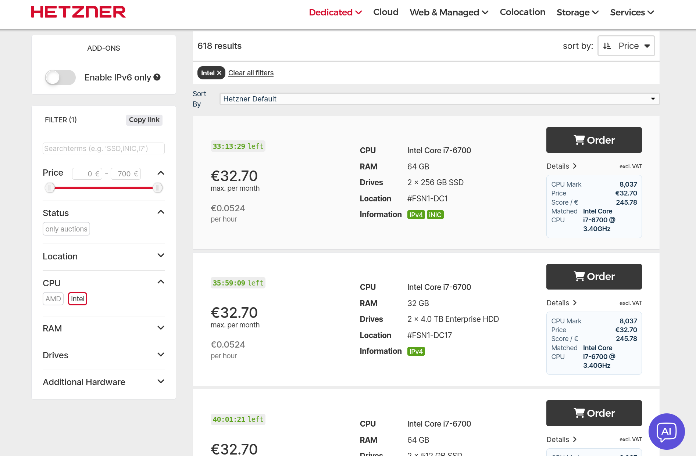

# passmark-api

Main goal: enhance Hetzner Server Auction with CPU performance insights via a userscript.

The userscript adds:
- PassMark CPU score per auction card
- Score per euro (`CPU Mark / monthly price`)
- Client-side sorting by `CPU Mark` and `Score / €`

Technical implementation details (scraper, storage, API) are documented in the `Technical Details` section below.

## Quick Start (Usage)

1. Install Tampermonkey (or Greasemonkey/Violentmonkey) in your browser.
2. Open this URL and install the userscript:

```text
https://raw.githubusercontent.com/yuhuishi-convect/passmark-api/main/userscripts/hetzner-auction-passmark.user.js
```

3. Open `https://www.hetzner.com/sb/` and refresh.
4. You should see:
   - `CPU Mark`
   - `Score / €`
   - `Sort By` options (`Hetzner Default`, `CPU Mark`, `Score / €`)

## Userscript (Main Product)

Userscript file:
- `userscripts/hetzner-auction-passmark.user.js`

Target page:
- `https://www.hetzner.com/sb/`

What it does:
- Detects each auction card CPU + monthly euro price.
- Calls this API (`/v1/cpus?query=...`) to get CPU Mark.
- Renders `CPU Mark` and `Score / €` on each card.
- Adds sorting for visible cards: `Hetzner Default | CPU Mark | Score / €`.

### Install (Detailed)

1. Install Tampermonkey (or Greasemonkey/Violentmonkey).
2. Install script from raw URL:

```text
https://raw.githubusercontent.com/yuhuishi-convect/passmark-api/main/userscripts/hetzner-auction-passmark.user.js
```

3. Open/reload `https://www.hetzner.com/sb/`.
4. Use the `Sort By` selector above auction cards:
   - `Hetzner Default`
   - `CPU Mark (High → Low)`
   - `Score / € (High → Low)`

### Screenshot



### Userscript Testing

Manual:
- Open `https://www.hetzner.com/sb/` and verify cards get a PassMark info box.

Automated:

```bash
yarn test
```

Userscript helper tests:
- `test/userscript/utils.test.js`

Headless Firefox E2E (fixture):

```bash
yarn playwright install firefox
yarn test:userscript:firefox
```

Live journey E2E (real Hetzner page + live API):

```bash
yarn test:userscript:firefox:real
```

## Technical Details

Backend services:
- Daily PassMark CPU scrape via Cloudflare Worker Cron Trigger
- Snapshot storage in Cloudflare R2
- Public Worker API with fuzzy CPU name lookup
- Cloudflare Browser Rendering fallback when direct fetch is blocked

## Requirements

- Node.js 20+
- Yarn 1.x or Yarn Berry
- Cloudflare account with Workers + R2 enabled

## Setup

1. Install dependencies:

```bash
yarn install
```

2. Create R2 bucket(s):

```bash
wrangler r2 bucket create passmark-cpu-scores
wrangler r2 bucket create passmark-cpu-scores-preview
```

3. Authenticate Wrangler:

```bash
wrangler login
```

4. Set optional admin token used by `POST /v1/admin/scrape`:

```bash
wrangler secret put ADMIN_TOKEN
```

5. (Optional) change bucket names and source URL in `wrangler.toml`.

6. Ensure Browser Rendering is enabled for your account (needed for fallback and browser checks).

7. Admin HTTP endpoints are disabled by default in production.
Use cron triggers for real ingestion. For local testing only, enable:

```bash
yarn wrangler dev --var ENABLE_TEST_ENDPOINTS:true
```

## Local development

```bash
yarn dev
```

## Test

```bash
yarn test
```

## Deploy

```bash
yarn deploy
```

## Cron schedule

Configured in `wrangler.toml`:

```toml
[triggers]
crons = ["0 3 * * *"]
```

Runs every day at 03:00 UTC.

## API

- `GET /health`
- `GET /v1/snapshots/latest`
- `GET /v1/snapshots/:date` (`YYYY-MM-DD`)
- `GET /v1/cpus?query=<name>&limit=5`
- `GET /v1/cpus/all`
- `GET /v1/cpus/:id`
- `POST /v1/admin/scrape` (manual scrape trigger)
- `GET /v1/admin/browser-check?url=<url>` (verify Browser Rendering)

`/v1/admin/*` is test-only and returns `403` unless `ENABLE_TEST_ENDPOINTS=true` (or localhost runtime).

### Example

```bash
curl "https://<your-worker-domain>/v1/cpus?query=ryzen%205600&limit=3"
```

```bash
curl -X POST "https://<your-worker-domain>/v1/admin/scrape" \\
  -H "Authorization: Bearer <ADMIN_TOKEN>"
```

## Data shape

Stored snapshot JSON in R2 (`snapshots/YYYY-MM-DD.json` and `snapshots/latest.json`):

```json
{
  "generatedAt": "2026-02-15T03:00:00.000Z",
  "date": "2026-02-15",
  "sourceUrl": "https://www.cpubenchmark.net/cpu_list.php",
  "total": 1000,
  "cpus": [
    {
      "id": "amd-ryzen-9-9950x-49120",
      "name": "AMD Ryzen 9 9950X",
      "cpuMark": 49120,
      "rank": 1,
      "sourceUrl": "https://www.cpubenchmark.net/cpu.php?cpu=AMD+Ryzen+9+9950X"
    }
  ]
}
```

Real E2E user-journey (live Hetzner page + live API):

```bash
yarn test:userscript:firefox:real
```
